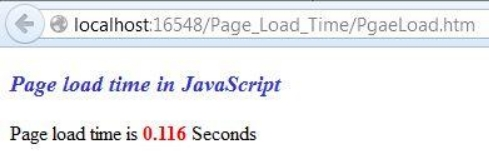
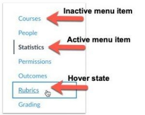

**Лабораторные работы на первый семестр курса Web-разработки.**

# ***Лабораторная 1***

Данная лабораторная подразумевает создание макета сайта без использования знаний CSS, только HTML. Создаем сайт резюме - портфолио. Главная задача данной лабораторной работы - ознакомиться с наиболее значимыми тегами и правилами их использования.

1) Установить любой текстовый редактор или же специализированное ПО (WebStorm и так далее) - на ваш выбор.
1) Определиться с темой проекта и нарисовать макет вашего сайта (схематично) - расположение картинок, текста, поля контактов.. - картинку также положить в гит репозиторий (Можно фотографию рисунка на листочке)

Пример:

В качестве темы подойдут: визитная карточка, портфолио с галереей, интернет-магазин, гостевая книга, блог и т.п.

1) Задать кодировку страницы  UTF-8
1) Описать ключевые слова в метаинформации страницы, а также в описании страницы
1) Для упрощения проектирования подключить файл стилей outlines.css (опционально)
1) Приступить к написанию сайта:
- Добавить Doctype
- Добавить теги <html>,<head>и<body>,

- Установить язык для сайта-русский
- Добавить заголовок страницы
- Убедиться что в readme.md указана ваше ФИО и номер группы, добавить в выбранную тему.
- Выделить логические элементы вашего сайта с помощью  тегов:
  - main
  - header
  - footer
- Использовать теги section, nav, article, aside, h1-h6, p - согласно их предназначению. (смотреть лекцию)
- Использовать теги перечисления (ul, ol) (например, для описание ваших успехов или неуспехов).
- Вставить блок с псевдографикой из символов ASCII
- Вставить snippet кода, оформив его соответствующими тегами.
- Добавить цитату и формулу вашего успеха (желательно использовать тэги sub и sup)

Для выделения наиболее важных моментов использовать strong и b, em и i, del и ins

\*Если имеется понимание, для чего нужен div и span - использовать, если нет, то начать изучать вопрос)

Цель работы - создание макета и наполнение его информацией. Если один-два подпункта из 6 пункта кажутся избыточными, и вы сможете доказать, почему на вашем сайте они не нужны (возможно предложив другие пункты) - на финальный балл не повлияет.

Для большей простоты выделения элементов и понимания их расположения предлагается использовать <https://github.com/ArtMan-8/outline-prototype> или аналоги.

# ***Лабораторная 2***

Цель лабораторной - научиться создавать и привязывать стили для элементов html. Про размещение элементов пока можно не думать, необходимо достичь эффекта, при котором отдельно взятый элемент смотрится законченным, красивым и приятным глазом. При этом вместе эти элементы не пестрят разными красками. Советую использовать сервисы по сочетаемости цветом - перед началом выполнения лабораторной определиться со стилистикой вашего сайта.

Например: <https://color.adobe.com/ru/>

На той же странице, написанной в рамках первой лабораторной работы:

1) Создать и подключить собственный файл стилей
1) Добавить стили всем элементам на странице (границы - отступы и шрифты). 
1) Должен быть использованы различные по типу селекторы. (Желательно по какой-либо конкретной методологии, например БЭМ)
1) Добавить картинки.
1) Определить цвета заливки и теней для элементов

Пример shadow drop:

1) Применить стили для текста, задать свойства:
1. размера шрифта
1. высоты строки
1. семейство используемых шрифтов
1. насыщенность шрифта
1. выравнивание текста (горизонтальное, вертикальное)
1. Фон и цвет текста
1. Отступы
1. пробелы
1. Стилизация  переформатированного текста
1. Подчеркивание, зачеркивание и  другие
1. Регистр символов

# ***Лабораторная 3***

Произвести выравнивание всех ранее описанных элементов вашего сайта используя удобный для вас способ - флексы или флоты либо применить 12-ти столбчатую вёрстку. Обязательное наличие горизонтальных и вертикальных рядов элементов. Если у вас до этого не было - всегда можно добавить – например, галерею с картинками.

Также необходимо проработать то, как ваш макет будет выглядеть на различных мониторах (на маленьком ноутбуке, полноценном Full HD, 2K монитор). Выбрать элементы, которые не будут отображаться на маленьких мониторах, например, рекламный баннер во всю длину footer’a.

1) Использовать css-правила @media screen для скрытия элементов не умещающихся в клиентскую область
1) Закрепить элемент с помощью абсолютного позиционирования - например строку меню либо шапку или подвал сайта.
1) Добавить на страницу таблицу с заголовками и стилями для чётных и нечётных строк. В качестве типа отображения таблицы рекомендуется воспользоваться grid’ом, для достижения лучшей адаптивности. (т.е. необходимо добиться того, чтобы колонки таблицы изменяли свой размер в зависимости от размера окна)
   пример:
   

# ***Лабораторная 4***

Цель лабораторной работы – научится взаимодействовать со элементами и браузером используя встроенной скриптовой движок JavaScript.

1) Добавить новые страницы для вашего проекта, согласно пунктам меню в шапке сайта.
1) Создать скрипт, который будет выполнятся на каждой странице, добавить его в отдельную папку и подключить в разделе <head> ваших страниц.
1) Используя IIFE, подписаться на события загрузки страницы и вывести в подвал статистическую информацию о скорости загрузки:

   
1) Добавить интерактивности меню, обработать события наведения мыши на конкретные пункты с использованием CSS либо JS.

   
1) В зависимости от того, на какой странице находится пользователь (можно понять по document.location) добавить соответствующему пункту меню CSS class, отвечающий за «активное» состояние (см. пример выше).

# ***Лабораторная 5***

Целью работы заключается в получении практических навыков по созданию разметки во время выполнения (in runtime).

Необходимо создать отдельную страницу с Web-формой, в которой пользователь с помощью предложенных параметров мог бы создать таблицу по некоему шаблону, например, расписание занятий на 5-ти дневную либо 6-ти дневную неделю, выбрать максимальное количество занятий, язык на котором будет сгенерирована таблица и тому подобное.

Примерный ожидаемый результат лабораторной работы на примере проекта «список дел»: <https://i.imgur.com/y5m4LyI.gif>

1) Создать отдельную страницу и отдельный файл со скриптом, добавить ссылку на «конструктор» в меню.
1) Добавить <form> на новую страницу и 
 контейнер куда будут размещены результаты генерации.
1) Обработать событие отправки формы (перехватить событие onSubmit) и без перезагрузки страницы отобразить результат генерации
1) Предусмотреть возможность сохранения и загрузки введенных пользователем параметров в локальное хранилище браузера пользователя (читай как LocalStorage).

\* Для стилизации элементов не используйте атрибуты style, предпочтительно использование атрибутов class из вашего заранее созданного файла со стилями.

# ***Лабораторная 6***

Цель лабораторной работы – познакомится с сущностью Promise и научится создавать http-запросы и корректно обрабатывать ответы.

В качестве практикума студентам предлагается добавить «живых» данных на уже имеющийся прототип. В качестве поставщика данных использовать сервис с Mock данными, например: <https://jsonplaceholder.typicode.com>

Перед началом работы необходимо выбрать ту часть проекта, в которую в дальнейшем будут загружаться данные. Это может быть профиль пользователя, прошедшего авторизацию, комментарии под той или иной фото в галерее, список пользователей в одной из уже созданных таблиц и т.п.

В качестве данных, которые предоставляет сервис из примера, предлагается 6 видов ресурсов на выбор:

- Сообщения для гостевой книги/форума 
  (Поля: body (само сообщение), title (заголовок)
- Комментарии под фото либо любым другим материалом
  (Поля: name (автор комментария), email (email автора комментария), body (комментарий)
- Альбомы и фотографии 
  (Поля: title (название), thumbnailUrl (ссылка на маленькое изображение), url (ссылка на изображение))
- Список дел
  (Поля: title (описание), completed (boolean флаг))
- Пользователи
  (Поля: username, name, email, address, phone, website, company)

1) Добавить отдельный скрипт и подключить на страницу где подразумевается сетевое взаимодействие.
1) Добавить gif-анимацию либо свою произвольную css-анимацию для элемента типа preloader под элементом где планируется отобразить запрашиваемый контент 
1) Дождаться события загрузки страницы и инициализовать обращение к поставщику данных используя Fetch API (<https://developer.mozilla.org/ru/docs/Web/API/Fetch_API>)
1) После получения ответа, скрыть preloader, десериализовать данные в JSON объект и отрендерить полученные данные.
1) Добавить псевдо-случайную фильтрацию к запросам (например при первом обращении получать комментарии с id 100 и выше, а при втором c id 200 и меньше).
1) Добавить обработку ошибок (например – сеть перестала быть доступна и запрос не был выполнен), в случае исключительной ситуации добавить под элементом заплатку, например, «⚠ Что-то пошло не так».

# ***Лабораторная 7***

Целью лабораторной работы является изучение продвинутых практик взаимодействия с DOM и CSS с использованием подключаемых JS библиотек.

Студентам предлагается продемонстрировать умения работы со сторонними API популярных библиотек.

1) Выберите одну – две UI библиотеки которые можно интегрировать в ваш проект из предложенного списка: [https://github.com/sorrycc/awesome-javascript](https://github.com/sorrycc/awesome-javascript#sliders)

   Например: Модальное окно + Toster

    + 

   Либо: Слайдер для вашей галереи
   <https://swiperjs.com/demos/130-centered/core.html>

3) Опишите use-case сценарий с использованием выбранных библиотек и реализуйте его.

4) Добавьте комментарии в JS-коде перед вызовами сторонних библиотек с указанием того какой аргумент функции для чего используется и как именно вы конфигурируете ту или иную часть библиотеки.

5) Добавьте стилизацию подключенных компонентов, чтобы они не выбивались из уже используемой цветовой палитры вашего проекта.

` `\* Лабораторная работа скорее творческая и поможет добрать недостающие баллы если подключенные библиотеки будет использованы качественно в полном объеме предлагаемых возможностей. (т.е. подключение всего Bootstrap фреймворка ради одного элемента внутри таблички не выглядит оправданным)
